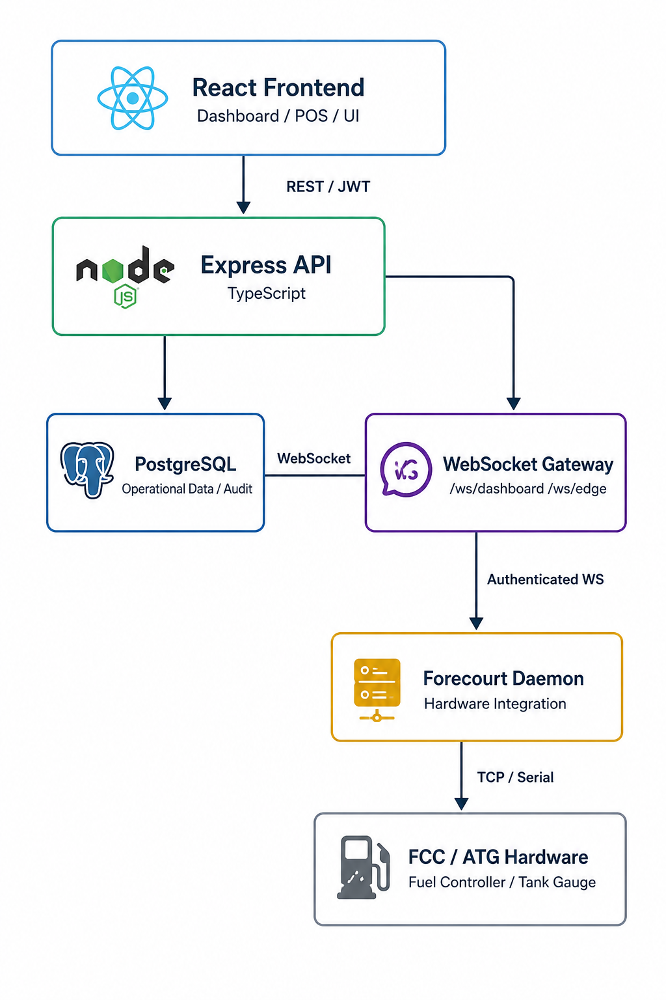

# FuelMaster

**Enterprise Forecourt & Point-of-Sale Management Platform**

FuelMaster is a full-stack forecourt and point-of-sale management platform engineered for modern fuel-station operations. It brings together station operations, point-of-sale workflows, real-time pump and tank telemetry, hardware integration, inventory, financial operations, staff management, customer accounts, reporting, and day-to-day retail processes within a unified platform.

---

## Table of Contents

- [Overview](#overview)
- [Architecture](#architecture)
  - [Architecture Principles](#architecture-principles)
  - [Hardware Integration](#hardware-integration)
  - [Tank Volume Calculation](#tank-volume-calculation)
- [Core Capabilities](#core-capabilities)
- [Technology Stack](#technology-stack)
- [Project Structure](#project-structure)
- [Getting Started](#getting-started)
- [Security](#security)
- [Data & Transaction Integrity](#data--transaction-integrity)
- [Real-Time Telemetry](#real-time-telemetry)
- [Development & Quality](#development--quality)
- [Known Limitations](#known-limitations)
- [Engineering Roadmap](#engineering-roadmap)
- [Project Status](#project-status)
- [Author](#author)

---

## Overview

FuelMaster is designed as an operational application rather than a UI-only prototype.

The platform is structured around a clear separation of concerns between:

- **React frontend** for dashboards, POS workflows, and user interaction.
- **Express/TypeScript API** for business logic and application services.
- **PostgreSQL** for operational data and audit records.
- **WebSocket Gateway** for authenticated real-time communication.
- **Forecourt Daemon** for station-edge hardware integration.
- **FCC/ATG hardware** for fuel-controller and tank-gauge communication.

This architecture keeps physical forecourt equipment isolated from the browser while providing the application with a controlled path for real-time operational data.

Where functionality is not yet production-complete—primarily selected secondary analytics widgets and vendor-specific FCC protocol parsing—the current implementation status is explicitly documented under [Known Limitations](#known-limitations).

---

## Architecture

The following architecture represents the intended application and hardware integration flow.



### Architecture Flow

| Layer | Responsibility | Communication |
|---|---|---|
| **React Frontend** | Dashboard, POS, and user interface | REST / JWT |
| **Express API** | Application services and backend business logic | HTTP / REST |
| **PostgreSQL** | Operational data and audit records | Database connection |
| **WebSocket Gateway** | Authenticated real-time telemetry and edge communication | WebSocket |
| **Forecourt Daemon** | Hardware integration and telemetry normalization | Authenticated WebSocket |
| **FCC / ATG Hardware** | Fuel controller and tank-gauge communication | TCP / Serial |

### Architecture Principles

FuelMaster follows several important engineering boundaries:

1. **The browser does not communicate directly with forecourt hardware.**
2. **Backend services own application and operational transactions.**
3. **PostgreSQL remains the primary operational data store.**
4. **Real-time station telemetry is isolated behind an authenticated WebSocket layer.**
5. **Hardware-specific protocols are abstracted behind driver interfaces.**
6. **Each station can use its own edge-daemon credential.**
7. **The architecture allows hardware vendors to be integrated without coupling the entire application to a single controller implementation.**

---

## Hardware Integration

The POS and dashboard **do not communicate directly with forecourt hardware**.

A dedicated **Forecourt Daemon** process owns the hardware connection. It is responsible for:

- Communicating with the Fuel Controller (FCC).
- Communicating with the Automatic Tank Gauge (ATG).
- Normalizing hardware telemetry.
- Forwarding station information through an authenticated WebSocket connection.
- Providing an abstraction boundary between vendor-specific hardware and the core application.

Each station can authenticate its own edge daemon using a station-specific credential generated through:

```http
POST /api/stations/:id/edge-token/rotate
```

This avoids relying on one shared credential across multiple stations.

### Driver Abstraction

The hardware layer uses driver abstractions such as:

```text
FccDriver
AtgDriver
```

This design allows vendor-specific implementations to be introduced without coupling the rest of the application directly to a particular controller or tank-gauge implementation.

For local development and demonstrations, FuelMaster also includes an edge simulator that produces telemetry through the same WebSocket communication path used by the edge integration layer.

---

## Tank Volume Calculation

Tank volume is derived from the probe's raw height measurement.

Where a tank has a calibrated **strapping table**, FuelMaster uses the corresponding calibration data.

Where a calibration table is unavailable, the system falls back to horizontal-cylinder geometry rather than using a simple linear approximation.

This approach provides a more appropriate basis for tank-volume estimation while allowing calibrated station-specific measurements to take precedence.

---

## Core Capabilities

### Forecourt & Operations

- Multi-station dashboard
- Live forecourt monitoring
- Point-of-sale operations
- Fuel and shop-item sales
- Cash, card, and mobile-money payment recording
- Fleet-account transactions
- Dispenser management
- Nozzle management
- Fuel-tank management
- Tank-gauge monitoring
- Tank calibration and strapping tables
- Controller management
- Inventory management
- Fuel deliveries
- Fuel-price management

### Accounts & Customer Management

- Fleet accounts
- Customer management
- Loyalty management
- CRM workflows
- Financial and operational reports
- Analytics dashboards

### Back Office

- Maintenance management
- Cash management
- Shift management
- User management
- Administration
- System settings
- System health monitoring
- Audit logs

### Authentication & Security

- JWT-based authentication
- Short-lived access tokens
- Refresh-token authentication
- Refresh-token rotation
- Role-based authorization
- Email-based two-factor authentication
- Email verification during account registration
- Per-station edge-daemon credentials
- Authenticated WebSocket connections
- Optional TLS for telemetry communication
- Rate limiting on authentication endpoints
- Audit logging for operational activity

### Notifications

FuelMaster supports event-driven notifications through:

- Email
- SMS
- Web Push notifications
- VAPID-based browser push

Notifications can be triggered by operational events such as:

- Low fuel levels
- Fuel-delivery status changes
- Fleet accounts exceeding credit limits

### User Experience

- Responsive desktop and mobile layouts
- Mobile navigation drawer
- Dark and light themes
- Configurable interface density
- Configurable accent colour
- Real-time dashboard updates

---

## Technology Stack

| Layer | Technology |
|---|---|
| **Frontend** | React 19, TypeScript, Vite, Tailwind CSS v4, Recharts |
| **Backend** | Node.js, Express, TypeScript |
| **Database** | PostgreSQL |
| **Real-Time Communication** | WebSocket (`ws`) |
| **Authentication** | JWT, bcrypt |
| **Notifications** | Brevo, Web Push, VAPID |
| **Hardware Integration** | FCC/ATG driver abstractions, TCP/serial communication |
| **Development Runtime** | Node.js 20+, npm |

---

## Project Structure

```text
fuelmaster/
├── src/
│   ├── pages/              # Application pages and operational modules
│   ├── components/         # Shared UI components
│   └── lib/                # API client, WebSocket hooks, utilities
│
├── server/
│   ├── src/
│   │   ├── routes/         # REST API endpoints
│   │   ├── ws/             # WebSocket gateway, edge daemon and simulator
│   │   ├── drivers/        # FCC/ATG driver interfaces and implementations
│   │   ├── services/       # Notifications and application services
│   │   └── db/             # Database schema and migration logic
│   │
│   └── README.md           # Backend-specific documentation
│
└── docs/
    └── architecture.png    # System architecture diagram
```

---

## Getting Started

### Prerequisites

Before starting development, ensure the following are installed:

- Node.js 20+
- PostgreSQL
- npm

### 1. Configure the Backend

```bash
cd server
npm install
cp .env.example .env
```

Configure the required environment variables in `.env`.

Refer to [`server/README.md`](server/README.md) for backend-specific configuration details.

### 2. Create the Database

Create the development database:

```bash
psql -U postgres -c "CREATE DATABASE fuelmaster;"
```

Run the database migrations:

```bash
npm run db:migrate
```

### 3. Seed Development Data

```bash
npm run db:seed
```

The seed process creates development stations, users, and sample operational data.

For security, development credentials are not published in this repository. The seed process prints the credentials required for the local development environment after completion.

> **Security:** Never reuse development seed credentials in a production deployment.

### 4. Start the Backend

```bash
npm run dev
```

The development environment starts:

- REST API on `:4000`
- WebSocket telemetry gateway on `:4001`

### 5. Start the Forecourt Simulator

In a separate terminal:

```bash
cd server
npm run edge:simulate
```

The simulator generates pump and tank telemetry for development and demonstration without requiring physical forecourt hardware.

### 6. Start the Frontend

From the project root:

```bash
npm install
npm run dev
```

The Vite development server makes the frontend available at:

```text
http://localhost:5173
```

---

## Security

FuelMaster incorporates application and communication security controls across the frontend, backend, real-time communication, and station-edge layers.

### Authentication & Authorization

- JWT access and refresh tokens
- Refresh-token rotation and revocation
- Authenticated application routes
- Role-based authorization
- Rate limiting on authentication endpoints
- Email verification during self-service registration
- Optional email-based two-factor authentication

### Edge & Real-Time Security

- Authenticated WebSocket connections
- Station-specific edge-daemon credentials
- Optional TLS for telemetry communication
- Separation between browser clients and physical hardware

### Secrets Management

Production credentials and secrets must **never** be committed to source control.

Use:

```text
.env
```

for local environment configuration and:

```text
.env.example
```

to document required environment variables without exposing their values.

---

## Data & Transaction Integrity

PostgreSQL is the primary operational database.

The data model includes relationships covering:

- Stations
- Users
- Roles
- Sales
- Payments
- Dispensers
- Nozzles
- Tanks
- Tank gauges
- Deliveries
- Inventory
- Fleet accounts
- Customers
- Loyalty
- Expenses
- Cash management
- Shifts
- Maintenance
- Audit logs

Transaction-sensitive operations are handled server-side, with database constraints and transaction controls used where appropriate to preserve data integrity.

---

## Real-Time Telemetry

Forecourt telemetry follows a controlled edge-to-application path:

```text
Forecourt Hardware
        │
        ▼
Forecourt Daemon
        │
        │ Authenticated WebSocket
        ▼
WebSocket Gateway
        │
        ├──────────────► Dashboard
        │
        └──────────────► Operational Services
```

This separation provides an important architectural boundary:

- Physical hardware remains isolated from the browser.
- Hardware communication is owned by the edge daemon.
- Telemetry is normalized before reaching application consumers.
- The WebSocket gateway provides an authenticated real-time communication layer.
- Dashboards and operational services can consume station events without managing physical hardware protocols directly.

---

## Development & Quality

The current development workflow includes:

- TypeScript type checking
- Production build validation
- Database migration validation
- Structured frontend and backend modules
- Environment-based configuration
- Git-based source control

Automated behavioral tests are **not yet implemented**.

Current CI/development validation focuses primarily on type safety and build correctness. Automated unit, integration, and end-to-end testing are planned improvements as the platform progresses toward production readiness.

---

## Known Limitations

The following areas are intentionally documented as incomplete or partially implemented.

### Analytics

A small number of secondary analytics sub-tabs remain illustrative rather than connected to live queries. The main operational dashboards and the majority of analytics functionality are backed by real database queries.

### FCC Hardware Integration

The FCC driver architecture and integration layer are in place; however, vendor-specific FCC protocol parsing has not yet been completed against a production controller specification.

The ATG integration is further developed and includes support for the Veeder-Root protocol.

### Automated Testing

A comprehensive automated behavioral test suite has not yet been implemented.

The current development pipeline validates TypeScript type safety and production builds. Broader automated testing remains a planned production-readiness improvement.

These limitations are documented deliberately so that the current implementation status remains transparent.

---

## Engineering Roadmap

The platform is designed to evolve toward a production-ready forecourt management system through:

- Additional vendor-specific FCC drivers
- Expanded ATG hardware support
- Automated unit and integration testing
- Broader end-to-end test coverage
- Expanded multi-station analytics
- Additional operational automation
- Further hardening of production security controls
- Production validation of station-edge hardware integrations

---

## Project Status

**Development / Advanced Prototype**

FuelMaster currently demonstrates a working full-stack architecture with:

- Real API-backed operational modules
- PostgreSQL persistence
- Authenticated real-time communication
- Hardware integration abstractions
- Development hardware simulation
- Authentication and authorization controls
- Event-driven notifications
- Multi-station operational workflows

Production deployment would require completion and validation of vendor-specific hardware integrations, comprehensive automated testing, production security review, and operational acceptance testing.

---

## Author

**Kimunya Joseph Muriithi**

Full Stack Software Engineer  
Nairobi, Kenya

GitHub: https://github.com/jo799/Fuelmaster

---

## Documentation Note

The architecture diagram included in this README is maintained as:

```text
docs/architecture.png
```

